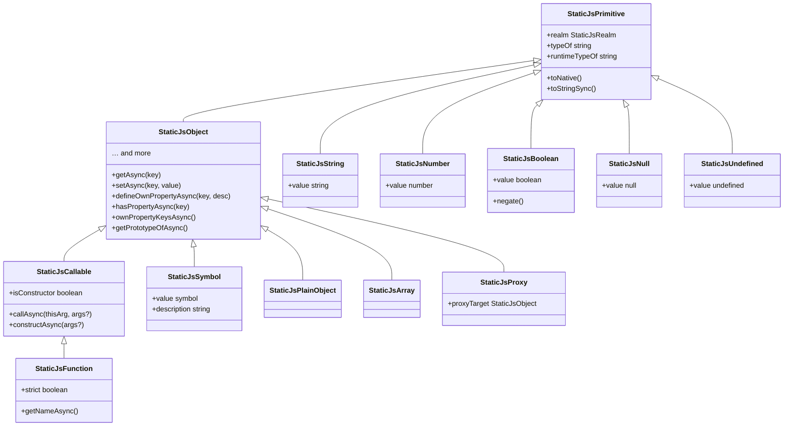

# Types

Every value that exists inside a StaticJs sandbox is a [`StaticJsValue`](./value.md). The type system mirrors JavaScript's own primitives and objects, but wraps them so the host can inspect, create, and manipulate sandbox values safely without executing untrusted code directly.

All types carry a `realm` reference and implement the [`StaticJsPrimitive`](./primitive.md) base interface. Object-like types additionally implement [`StaticJsObject`](./object.md), which provides the full ECMAScript internal-method API (`[[Get]]`, `[[Set]]`, `[[DefineOwnProperty]]`, etc.) as async/sync/evaluator triplets.

---

## Inheritance diagram



---

## Union types

Two union types group related concrete types for type-narrowing purposes:

### StaticJsValue

`StaticJsValue` is a type representing every possible StaticJs value. Use [`isStaticJsValue`](./value.md#isstaticjsvaluevalue) to check, or the more specific guards below to narrow further.

```
StaticJsValue = StaticJsScalar | StaticJsPlainObject | StaticJsArray | StaticJsFunction | ...
```

### StaticJsScalar

`StaticJsScalar` covers the non-compound types. All StaticJsScalar types include a `.value` property reflecting the native, non-sandbox value. Use [`isStaticJsScalar`](./scalar.md#isstaticjsscalarvalue) to narrow to any scalar.

```
StaticJsScalar = StaticJsString | StaticJsNumber | StaticJsBoolean
               | StaticJsNull | StaticJsUndefined | StaticJsSymbol
```

:::note[Symbols are dual-classified]
`StaticJsSymbol` appears in both the `StaticJsScalar` union (it is a primitive in JavaScript) and extends `StaticJsObject` in the interface hierarchy (so the sandbox can support `Symbol.prototype` method access internally). [`isStaticJsScalar`](./scalar.md#isstaticjsscalarvalue) returns `true` for symbols; [`isStaticJsObject`](./object.md#isstaticjsobjectvalue) also returns `true` for them.
:::

---

## Type reference

| Type                                     | Kind           | Type guard                                                            | `.value`                                                     |
| ---------------------------------------- | -------------- | --------------------------------------------------------------------- | ------------------------------------------------------------ |
| [StaticJsValue](./value.md)              | Union          | [isStaticJsValue](./value.md#isstaticjsvaluevalue)                    | —                                                            |
| [StaticJsPrimitive](./primitive.md)      | Base interface | [isStaticJsPrimitive](./primitive.md#isstaticjsprimitivevalue)        | —                                                            |
| [StaticJsScalar](./scalar.md)            | Union          | [isStaticJsScalar](./scalar.md#isstaticjsscalarvalue)                 | `string \| number \| boolean \| null \| undefined \| symbol` |
| [StaticJsObject](./object.md)            | Base interface | [isStaticJsObject](./object.md#isstaticjsobjectvalue)                 | —                                                            |
| [StaticJsString](./string.md)            | Concrete       | [isStaticJsString](./string.md#isstaticjsstringvalue)                 | `string`                                                     |
| [StaticJsNumber](./number.md)            | Concrete       | [isStaticJsNumber](./number.md#isstaticjsnumbervalue)                 | `number`                                                     |
| [StaticJsBoolean](./boolean.md)          | Concrete       | [isStaticJsBoolean](./boolean.md#isstaticjsbooleanvalue)              | `boolean`                                                    |
| [StaticJsNull](./null.md)                | Concrete       | [isStaticJsNull](./null.md#isstaticjsnullvalue)                       | `null`                                                       |
| [StaticJsUndefined](./undefined.md)      | Concrete       | [isStaticJsUndefined](./undefined.md#isstaticjsundefinedvalue)        | `undefined`                                                  |
| [StaticJsSymbol](./symbol.md)            | Concrete       | [isStaticJsSymbol](./symbol.md#isstaticjssymbolvalue)                 | `symbol`                                                     |
| [StaticJsPlainObject](./plain-object.md) | Concrete       | [isStaticJsPlainObject](./plain-object.md#isstaticjsplainobjectvalue) | —                                                            |
| [StaticJsArray](./array.md)              | Concrete       | [isStaticJsArray](./array.md#isstaticjsarrayvalue)                    | —                                                            |
| [StaticJsFunction](./function.md)        | Concrete       | [isStaticJsFunction](./function.md#isstaticjsfunction)                | —                                                            |
| [StaticJsProxy](./proxy.md)              | Concrete       | [isStaticJsProxy](./proxy.md#isstaticjsproxyvalue)                    | —                                                            |

All type guards and types are importable from `@suntime-js/core`.
